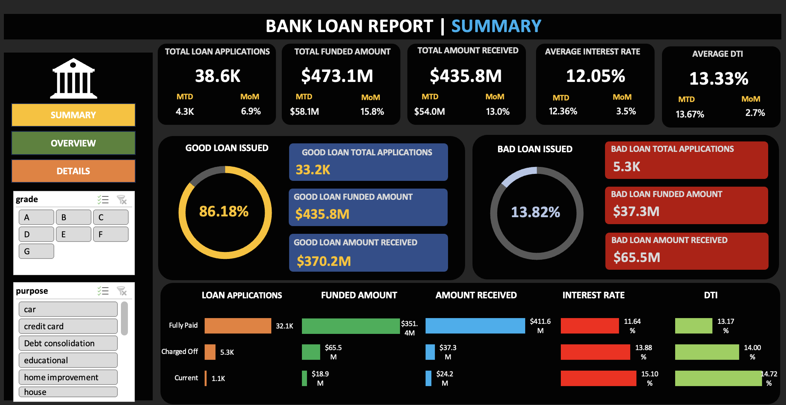
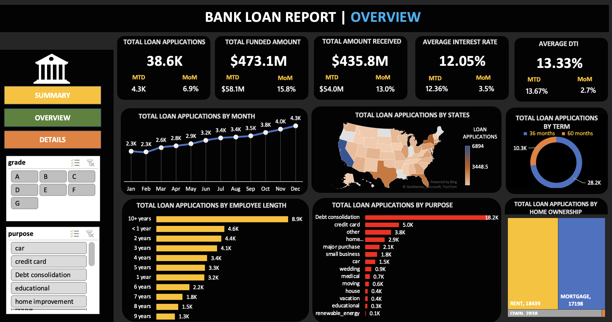

# Bank Loan Portfolio Analysis


**An Excel-based consumer loan portfolio analysis covering 38,576 loans and $435.8M in funded amount, evaluating portfolio performance, repayment behavior, and credit risk through interactive dashboards, PivotTables, PivotCharts, and dynamic formulas.**

---

## Project Summary

This project analyzes a consumer loan portfolio to evaluate lending performance, repayment behavior, and credit risk exposure.

It was built entirely in Microsoft Excel as a self-contained workbook. Every reported metric is calculated dynamically through PivotTables, PivotCharts, slicers, and formulas rather than being entered manually.

- **Records analyzed:** 38,576 loans across 25 fields
- **Data period:** 2021
- **Total funded amount:** $435,757,075
- **Total amount received:** $473,070,933
- **Good Loan Share:** 86.18%
- **Bad Loan Share:** 13.82%
- **Data source:** [Banking Loan Dataset — Kaggle]

> This is an educational portfolio-analysis project using a publicly available Kaggle dataset. It does not represent proprietary data from an actual bank.

---

## Business Problem

Lending institutions need ongoing visibility into portfolio health to manage credit risk, understand repayment behavior, and support underwriting decisions.

This project answers four core questions:

- How large is the loan portfolio, and how much has been collected?
- What proportion of loans are in good status versus charged off?
- How is lending activity trending month over month?
- Where is loan volume and risk concentrated by state, purpose, term, and borrower profile?

---

## Loan Classification

Loan statuses are grouped into two categories for portfolio-level risk analysis:

- **Good Loan** — Current or Fully Paid
- **Bad Loan** — Charged Off

This simplified classification allows the dashboard to compare loan counts, funded amounts, and amounts received across the two portfolio segments.

---

## Key Performance Indicators

| KPI | Value |
|---|---:|
| Total Loan Applications | 38,576 |
| Total Funded Amount | $435,757,075 |
| Total Amount Received | $473,070,933 |
| Average Interest Rate | 12.05% |
| Average Debt-to-Income Ratio | 13.33% |
| Good Loan Share | 86.18% |
| Bad Loan Share | 13.82% |
| Good Loan — Funded Amount | $370,224,850 |
| Good Loan — Amount Received | $435,786,170 |
| Bad Loan — Funded Amount | $65,532,225 |
| Bad Loan — Amount Received | $37,284,763 |
| 36-Month Term Loans | 28,237 |
| 60-Month Term Loans | 10,339 |

---

## Dashboards

### Summary Dashboard



The Summary Dashboard provides a high-level view of portfolio performance and risk.

- Core KPI cards with **month-to-date (MTD)** values and month-over-month change
- Good vs. Bad Loan breakdown by loan count, funded amount, and amount received
- Loan status grid covering Current, Fully Paid, and Charged Off
- Interactive slicers for filtering portfolio metrics and visualizations

### Overview Dashboard



The Overview Dashboard provides a broader view of lending activity, portfolio composition, and borrower characteristics.

- Monthly trend of loan applications, funding, and collections
- State-level loan volume using an Excel Map Chart
- Loan term distribution
- Loan purpose breakdown using a Treemap
- Employment length and home ownership breakdowns
- Interactive filtering through slicers

---

## Key Findings

- **86.18% of loans are classified as Good Loans** (Current or Fully Paid), while **13.82% are classified as Bad Loans** (Charged Off).
- **Total amount received ($473.1M) exceeds total funded amount ($435.8M)**, reflecting cumulative payments recorded in the dataset, including principal and interest components.
- Good loans have **$435.8M in payments received against $370.2M funded**.
- Bad loans have **$37.3M in payments received against $65.5M funded**, meaning payments received equal approximately **57% of the funded amount**.
- **36-month loans outnumber 60-month loans by approximately 2.7 to 1**, with 28,237 loans compared with 10,339.
- **Debt consolidation** is the leading loan purpose, followed by credit card refinancing.
- Most borrowers either **rent or have a mortgage**, while relatively few own their homes outright.

---

## Recommendations

- **Break down charge-off rates** by credit grade, term, and purpose before adjusting underwriting policy — the aggregate rate alone does not show where risk is concentrated.
- **Track funded-vs.-received trends monthly** rather than relying only on cumulative totals, to identify changes in repayment behavior.
- **Compare 36-month and 60-month loan performance** directly to determine whether longer terms warrant different pricing or approval criteria.
- **Investigate state-level concentration** to identify geographic segments contributing disproportionately to loan volume or credit risk.
- **Analyze loan-purpose performance** to determine whether certain purposes consistently exhibit higher charge-off rates or weaker repayment performance.

---

## Tools & Techniques

### Microsoft Excel

- PivotTables
- PivotCharts
- Slicers
- Native Excel Tables
- Dynamic formulas
- `GETPIVOTDATA`
- Map Charts
- Treemap Charts

### Analytical Approach

- Data cleaning and preparation
- Good vs. Bad Loan risk classification
- Portfolio-level KPI development
- Month-over-month trend analysis
- Category-level segmentation
- Geographic analysis
- Loan term analysis
- Loan purpose analysis
- Borrower profile analysis

---

## Limitations & Known Issues

- The analysis is based on historical loan data from **2021** and should not be interpreted as a predictive credit-risk model. No predictive model for future defaults or expected losses is included — the analysis is descriptive and diagnostic, not causal.
- The Good vs. Bad Loan classification is a simplified segmentation based on loan status and does not represent a comprehensive credit-risk methodology. Aggregate charge-off rates can hide significant differences across borrower segments, loan purposes, terms, and credit grades — segment-level breakdown by grade, term, and purpose is not yet included.
- Amount received reflects payments recorded in the dataset and should not be interpreted as a final lifetime recovery rate.

---

## Skills Demonstrated

- Data cleaning and preparation
- Exploratory data analysis
- PivotTable-based KPI design
- Dynamic formula reporting with `GETPIVOTDATA`
- Interactive Excel dashboard development
- Dashboard design and visual hierarchy
- Chart selection matched to data type
- Geographic and hierarchical visualization
- Business-oriented risk segmentation
- Portfolio performance analysis
- Trend analysis
- Data storytelling
- Translating raw data into decision-ready insights

---

## Repository Structure

```text
bank-loan-portfolio-analysis/
│
├── README.md
├── LICENSE
│
├── excel/
│   └── Bank_Loan_Analysis_Project.xlsx
│
└── screenshots/
    ├── bank.jpeg
    ├── summary_dashboard.png
    └── overview_dashboard.png
```

---

## How to Use This Project

1. Download the workbook from the `excel/` folder.
2. Open `Bank_Loan_Analysis_Project.xlsx` in **Microsoft Excel 2016 or later**.
3. Open the `SUMMARY DASHBOARD` tab to view portfolio-level KPIs and risk metrics.
4. Open the `OVERVIEW DASHBOARD` tab to explore portfolio trends and borrower characteristics.
5. Use the available slicers to filter the dashboards interactively.
6. KPI cards, PivotCharts, and related visualizations update based on the selected filters.
7. Open the `Design Sheet` to review the PivotTable structures and formula logic behind the reported metrics.

---

## Future Improvements

- Add charge-off rates by credit grade
- Analyze risk by loan purpose and term
- Compare 36-month vs. 60-month loan performance
- Add state-level charge-off analysis
- Develop borrower risk segmentation
- Add cohort-based repayment analysis
- Build a predictive default model
- Calculate expected loss and recovery metrics
- Recreate the dashboard in Power BI
- Automate data refresh and reporting

---

## Author

**Subachan Subedi**
[LinkedIn](https://www.linkedin.com/in/subachan-subedi/)

---

