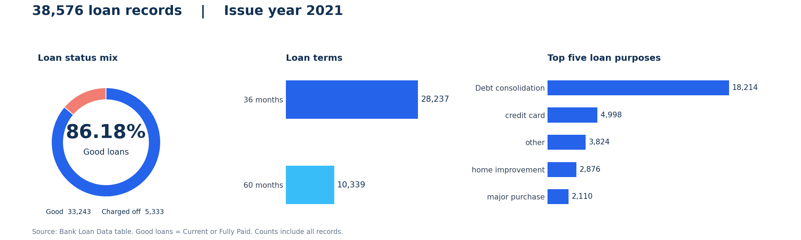
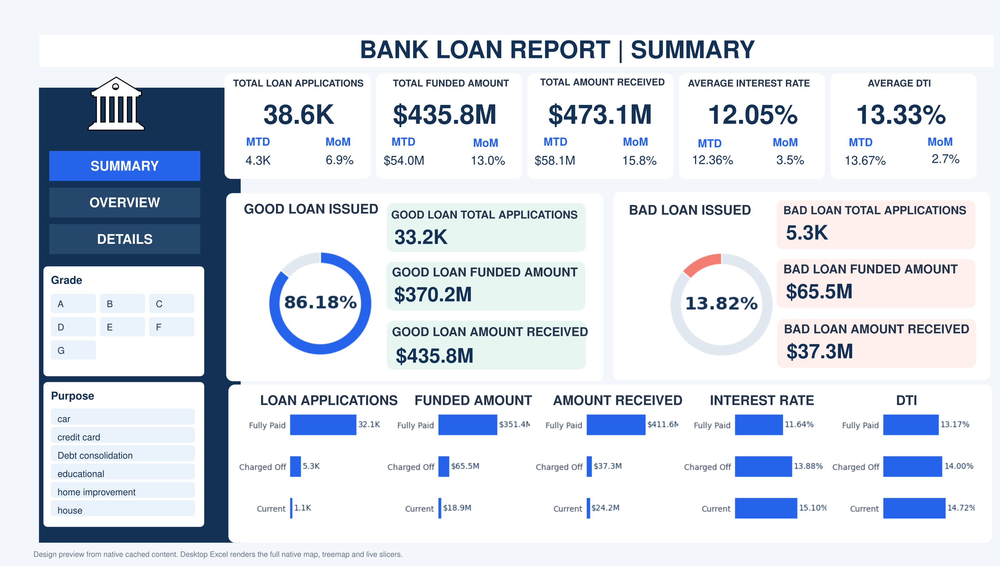
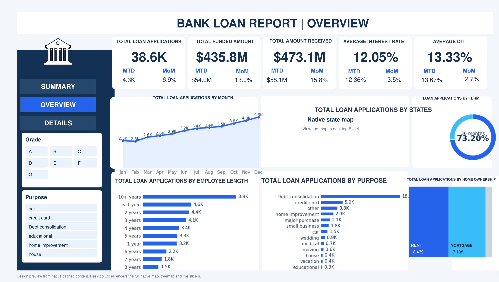

  

# 🏦 Bank Loan Portfolio Analysis

An Excel project for exploring lending activity, loan status, and borrower profiles across **38,576 consumer loans**. Two interactive dashboards bring together portfolio KPIs, monthly trends, and category comparisons using PivotTables, PivotCharts, slicers, and linked formulas.

  
  
  
  

**Quick links:** [Excel dashboard](Excel/Bank_Loan_Analysis_Project.xlsx) · [CSV data](Data/financial_loan.csv) · [Excel data](Data/Bank_Loan_Data.xlsx) · [Project report](Report/Bank_Loan_Project_Report.pdf)

## 📌 Project overview

A loan portfolio can contain thousands of accounts with different repayment statuses, terms, and borrower backgrounds. This project brings those records together so a reader can understand the size of the portfolio, see how activity changes through the year, and explore where loan volume is concentrated.

The analysis is built in Microsoft Excel. The `Bank Loan Data` sheet holds the loan table, the `Design Sheet` contains supporting PivotTables and formulas, and the two dashboard sheets present the results.

## 🎯 Questions explored

- How many loans are in the portfolio, and what amounts are recorded as funding and payments?
- How many loans are Current, Fully Paid, or Charged Off?
- How does monthly lending activity change during 2021?
- Where is loan volume concentrated by state, loan purpose, and repayment term?
- How do employment length and home ownership vary across borrowers?

## 📊 Portfolio snapshot

The figures below use the **source-column definitions** in the supplied workbook, with all records included.

| Measure | Value | Meaning |
|:--|--:|:--|
| Loan applications | 38,576 | Number of loan records |
| Funded amount | $435,757,075 | Sum of `loan_amount` |
| Amount received | $473,070,933 | Sum of `total_payment` |
| Average interest rate | 12.05% | Simple average of `int_rate` |
| Average debt-to-income ratio | 13.33% | Simple average of `dti` |
| Good loans | 33,243 / 86.18% | Current or Fully Paid |
| Bad loans | 5,333 / 13.82% | Charged Off |
| 36-month term | 28,237 / 73.20% | Share of loan records |
| 60-month term | 10,339 / 26.80% | Share of loan records |

## 🖥️ Explore the dashboards

### Summary dashboard

The `SUMMARY DASHBOARD` brings together the main KPIs, MTD and MoM measures, Good and Bad Loan comparisons, and loan-status charts. Grade and purpose slicers let users explore the connected views.

### Overview dashboard

The `OVERVIEW DASHBOARD` shows monthly loan applications, a state map, loan terms, employment length, loan purpose, and home ownership. The map and treemap remain native Excel charts.

The previews use native cached content. Desktop Excel displays the full native map, treemap, and live slicers.

| Workbook sheet | Role |
|:--|:--|
| `SUMMARY DASHBOARD` | Portfolio KPIs and status comparisons |
| `OVERVIEW DASHBOARD` | Lending trends and borrower composition |
| `Design Sheet` | Supporting PivotTables and KPI formulas |
| `Bank Loan Data` | Loan records in the native Excel table `Table1` |

**Navigation note:** The existing `DETAILS` button opens the loan-data sheet. There is no separate Details dashboard in this workbook.

## 🗂️ Data and definitions

The export contains **38,576 rows and 25 fields**, including the workbook's derived `Good Vs Bad Loan` classification. Loan issue dates fall in **2021**. The original project identifies the source as a public Kaggle banking-loan dataset, but its exact dataset URL is not included in the supplied repository.

| Field group | Examples |
|:--|:--|
| Record identifiers | `id`, `member_id` |
| Borrower information | `annual_income`, `emp_length`, `emp_title`, `home_ownership` |
| Loan characteristics | `loan_amount`, `term`, `purpose`, `grade`, `sub_grade`, `int_rate` |
| Status and payments | `loan_status`, `total_payment`, `installment` |
| Dates and location | `issue_date`, payment dates, `address_state` |
| Other measures | `dti`, `total_acc`, `verification_status`, `application_type` |

**Good Loan** means Current or Fully Paid. **Bad Loan** means Charged Off. “Good” is a reporting category, so a Current loan can still default later.

The CSV exports the existing classification as values and uses `YYYY-MM-DD` dates. The data-only Excel file keeps the native table and its classification formula. Neither export includes the extra totals row below the source table.

## 🔍 What the data shows

- **Most records are Fully Paid:** 32,145 loans, compared with 1,098 Current loans and 5,333 Charged Off loans.
- **Monthly loan volume rises across the year:** January has 2,332 applications and December has 4,314. December is about 85.0% higher than January; the series does not increase in every single month.
- **Debt consolidation leads loan purposes:** 18,214 loans, or 47.22% of the portfolio. Credit card loans follow with 4,998 records.
- **Shorter terms are more common:** 36-month loans represent 73.20% of records.
- **Renting and mortgages dominate:** 18,439 borrowers rent and 17,198 have a mortgage, together accounting for 92.38% of records.
- **California has the largest state count:** 6,894 loans, followed by New York with 3,701. These counts show concentration, rather than a comparison of state-level credit risk.

## 🛠️ Tools and approach

**Microsoft Excel:** native tables, PivotTables, PivotCharts, slicers, `GETPIVOTDATA`, linked shapes, a map chart, and a treemap.

The workflow starts with the loan table, groups loan statuses, aggregates measures in the supporting sheet, and displays those results through charts and KPI cards. MTD means month to date; MoM compares a month with the previous month. 

## 🚀 How to use

1. Download or clone this repository and open `Excel/Bank_Loan_Analysis_Project.xlsx` in a recent desktop version of Microsoft Excel. 
2. Start with `SUMMARY DASHBOARD` for the portfolio view.
3. Open `OVERVIEW DASHBOARD` to explore trends and borrower categories.
4. Use the grade and purpose slicers on the connected charts and PivotTables. Clear filters before comparing with the full-portfolio figures in this README.
5. Open `Design Sheet` to inspect the supporting calculations, or use `DETAILS` to reach the loan table.
6. Read the [Project report](Report/Bank_Loan_Project_Report.pdf) for definitions, findings, and limitations.

Some browser previews and alternative spreadsheet apps do not fully support Excel slicers or the native map and treemap. Opening the workbook in desktop Excel provides the intended experience.

## 📁 Repository contents

| Folder or file | Contents |
|:--|:--|
| `Excel/Bank_Loan_Analysis_Project.xlsx` | Refreshed analysis workbook |
| `Data/financial_loan.csv` | Export of all 38,576 loan records |
| `Data/Bank_Loan_Data.xlsx` | Standalone Excel data table |
| `Report/Bank_Loan_Project_Report.pdf` | Project report |
| `Screenshots/banner.png` | AI-generated project banner |
| `Screenshots/portfolio_snapshot.png` | Data-based portfolio visual |
| `Screenshots/summary.png` and `overview.png` | Dashboard design previews |
| `LICENSE` | Existing MIT license |

## 💡 Further analysis

Useful next steps include comparing charge-off shares by grade, term, purpose, and state, and checking repayment patterns by loan cohort. These are future improvements beyond this visual refresh and display correction.

## 📝 Interpretation and limitations

This is a historical, descriptive portfolio project. It does not predict defaults, calculate expected loss, or establish that a borrower characteristic causes credit risk. Loan counts alone do not show the risk of a segment.

`total_payment` is the payment amount recorded in the supplied table. It should not be treated as profit, a final lifetime recovery rate, or a complete statement of cash flows. The averages shown are simple averages, rather than averages weighted by loan size.

## 👤 Author

**Subachan Subedi** · [GitHub](https://github.com/subachansubedi) · [LinkedIn](https://www.linkedin.com/in/subachan-subedi/)

